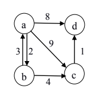

# Py-Dijkstra
Simple python implementation of dijkstra shortest path algorithm

### Instructions
`inputs.txt` file looks like this -
```
a b 2
a d 8
a c 9
b a 3
b c 4
c d 1
```

Take input from text file like below - 

```python
    $ python dijkstra.py <filename.txt> <src> <dest>
```


##### Example - 
```sh
> python dijkstra.py inputs.txt a d

Graph: 
-------
{'a': {'c': 9, 'b': 2, 'd': 8}, 'c': {'d': 1}, 'b': {'a': 3, 'c': 4}}

Shortest Paths: 
---------------
a -> b -> c -> d : 7
```
